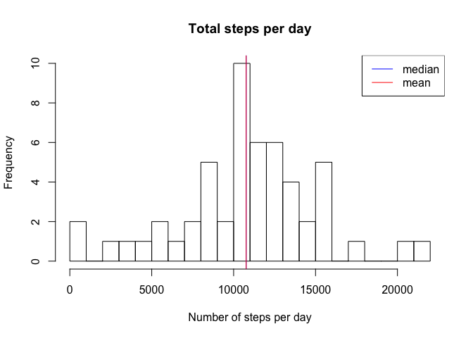
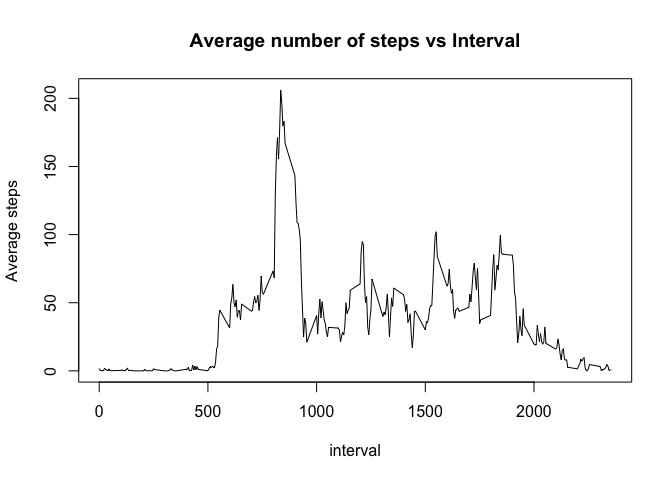
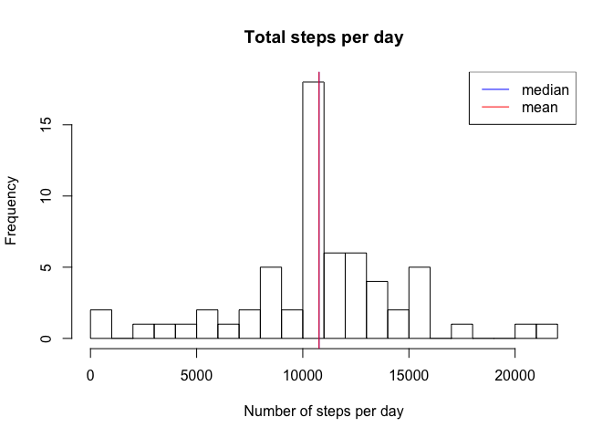
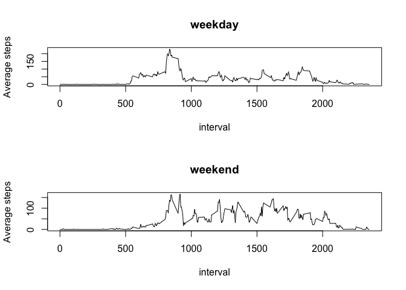

# Reproducible Research: Peer Assessment 1


## Loading and preprocessing the data

The following code reads the activity file and sets the first three columns data types to numeric, Date and numeric. The output gives us the summary of the data


```r
activity_data <- read.csv("activity.csv",colClasses = c("numeric","Date","numeric"))
summary(activity_data)
```

```
##      steps             date               interval     
##  Min.   :  0.00   Min.   :2012-10-01   Min.   :   0.0  
##  1st Qu.:  0.00   1st Qu.:2012-10-16   1st Qu.: 588.8  
##  Median :  0.00   Median :2012-10-31   Median :1177.5  
##  Mean   : 37.38   Mean   :2012-10-31   Mean   :1177.5  
##  3rd Qu.: 12.00   3rd Qu.:2012-11-15   3rd Qu.:1766.2  
##  Max.   :806.00   Max.   :2012-11-30   Max.   :2355.0  
##  NA's   :2304
```


## What is mean total number of steps taken per day?

1. Calculate the total number of steps taken per day


```r
activity_clean_data <- activity_data[!is.na(activity_data$steps),]
total_steps_day <- tapply(activity_clean_data$steps,activity_clean_data$date,function(x) sum(x,na.rm = TRUE))
```

2. Make a histogram of the total number of steps taken each day


```r
hist(total_steps_day,main= "Total steps per day",xlab="Number of steps per day",breaks=20)
abline(v=c(median(total_steps_day),mean(total_steps_day)),col=c("blue","red"),lwd=1)
legend(legend=c("median","mean"),"topright",col=c("blue","red"),lwd=1)
```

<!-- -->


```r
mean_activity <- mean(total_steps_day)
median_activity <- median(total_steps_day)
```

The mean of the data is 1.0766189\times 10^{4} and median of the data is 1.0765\times 10^{4}

## What is the average daily activity pattern?

1. Make a time series plot (i.e. type = "l") of the 5-minute interval (x-axis) and the average number of steps taken, averaged across all days (y-axis)


```r
Steps_by_interval <- aggregate(activity_clean_data$steps,list(interval = activity_clean_data$interval),mean)
plot(Steps_by_interval,type="l",ylab="Average steps",main="Average number of steps vs Interval")
```

<!-- -->

2. Which 5-minute interval, on average across all the days in the dataset, contains the maximum number of steps?


```r
max_steps_interval <- Steps_by_interval[which.max(Steps_by_interval$x),]
```

The interval with the maximum average number of steps per day is 835 with steps = 206.1698113.

## Imputing missing values

1. Calculate and report the total number of missing values in the dataset (i.e. the total number of rows with NAs)

```r
num_missing_values <- sum(is.na(activity_data$steps))
```

The number of missing values are 2304

2. Devise a strategy for filling in all of the missing values in the dataset. The strategy does not need to be sophisticated. For example, you could use the mean/median for that day, or the mean for that 5-minute interval, etc.

The missing data will be filled by the respective average number of steps per day in that interval


```r
activity_missing_data <- activity_data[is.na(activity_data$steps),]
activity_missing_data_impute <-  merge(activity_missing_data,Steps_by_interval,by="interval",all.x=TRUE)[,c(4,3,1)]
colnames(activity_missing_data_impute)[1] = "steps"
```

3. Create a new dataset that is equal to the original dataset but with the missing data filled in.


```r
final_activity_data <- rbind(activity_clean_data,activity_missing_data_impute)
```


4. Make a histogram of the total number of steps taken each day and Calculate and report the mean and median total number of steps taken per day. Do these values differ from the estimates from the first part of the assignment? What is the impact of imputing missing data on the estimates of the total daily number of steps?


```r
total_steps_day_final <- tapply(final_activity_data$steps,final_activity_data$date,sum)
mean_activity_final <- mean(total_steps_day_final)
median_activity_final <- median(total_steps_day_final)

hist(total_steps_day_final,main= "Total steps per day",xlab="Number of steps per day",breaks=20)
abline(v=c(median(total_steps_day_final),mean(total_steps_day_final)),col=c("blue","red"),lwd=1)
legend(legend=c("median","mean"),"topright",col=c("blue","red"),lwd=1)
```

<!-- -->

The mean of the data after imputing for missing values is 1.0766189\times 10^{4} and median of the data is 1.0766189\times 10^{4}
The mean and median have become equal median increased in value. 


## Are there differences in activity patterns between weekdays and weekends?

1. Create a new factor variable in the dataset with two levels -- "weekday" and "weekend" indicating whether a given date is a weekday or weekend day.


```r
final_data_with_day <- cbind(final_activity_data,day = weekdays(final_activity_data$date)) 
final_data_with_day[,4] <- ifelse(final_data_with_day[,4]=="Saturday" | final_data_with_day[,4]=="Sunday", "weekend","weekday") 
final_data_weekdays <- final_data_with_day[final_data_with_day$day == "weekday",]
final_data_weekend <- final_data_with_day[final_data_with_day$day =="weekend",]
```


2. Make a panel plot containing a time series plot (i.e. type = "l") of the 5-minute interval (x-axis) and the average number of steps taken, averaged across all weekday days or weekend days (y-axis). See the README file in the GitHub repository to see an example of what this plot should look like using simulated data.


```r
Steps_by_interval_weekdays <- aggregate(final_data_weekdays$steps,list(interval = final_data_weekdays$interval),mean)
Steps_by_interval_weekend <- aggregate(final_data_weekend$steps,list(interval = final_data_weekend$interval),mean)

par(mfcol= c(2,1))
plot(Steps_by_interval_weekdays,type="l",ylab="Average steps",main="weekday")
plot(Steps_by_interval_weekend,type="l",ylab="Average steps",main="weekend")
```

<!-- -->


